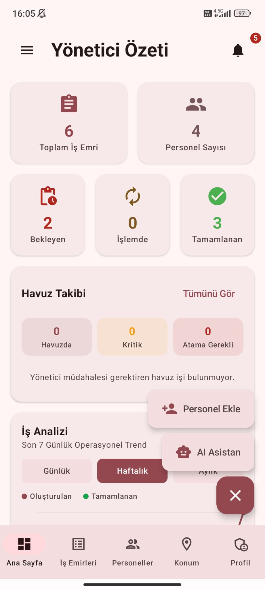
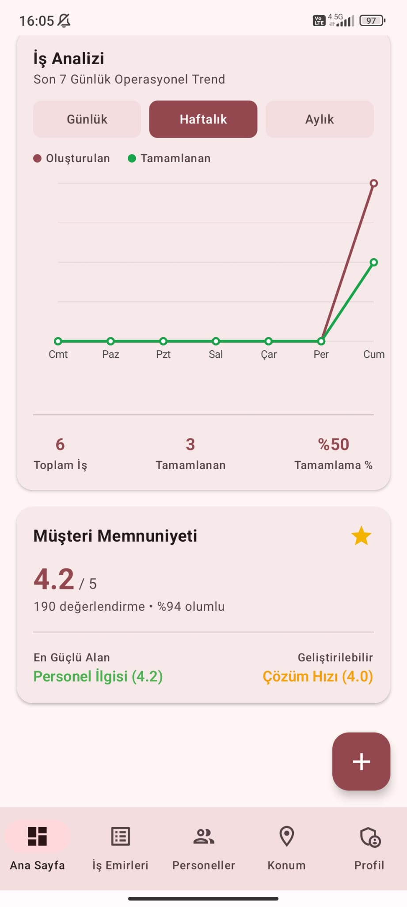
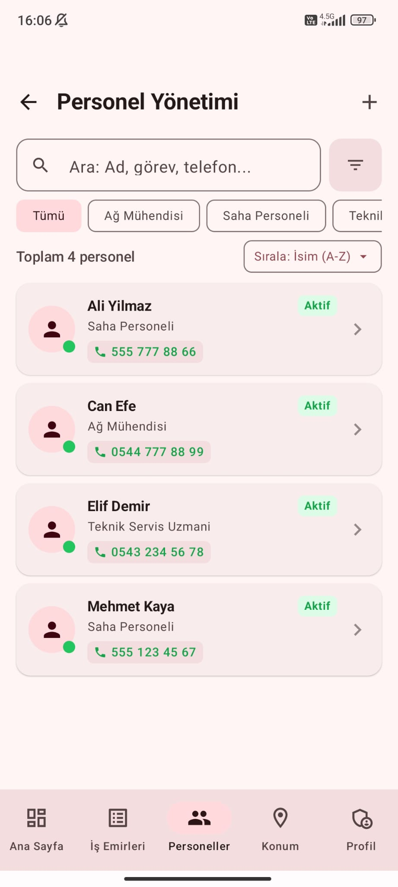
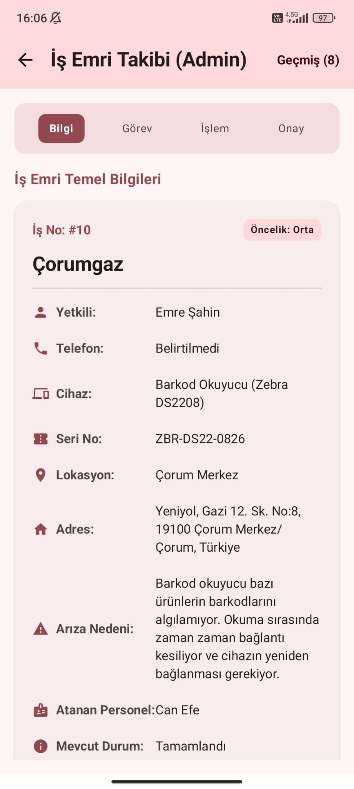
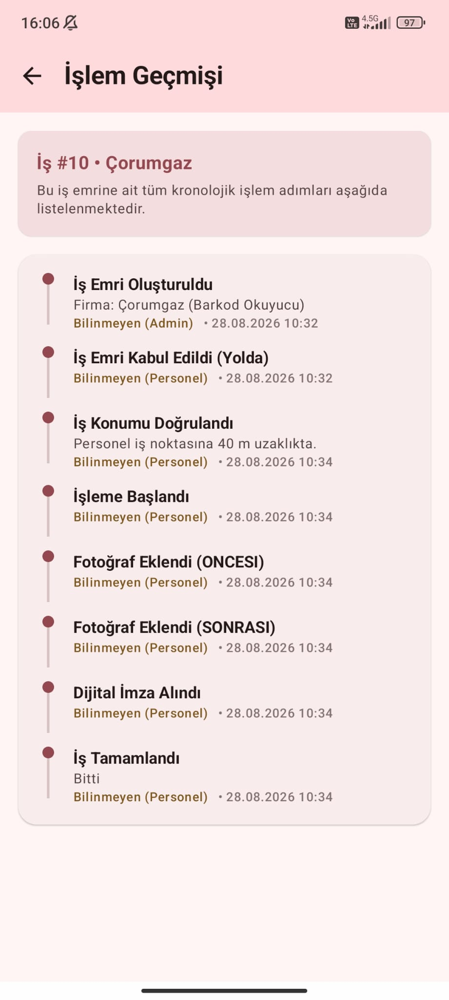
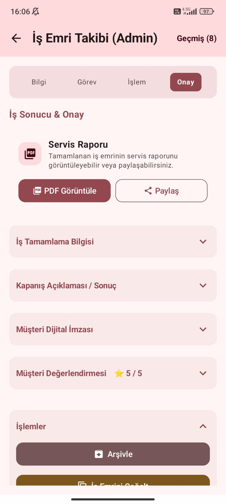
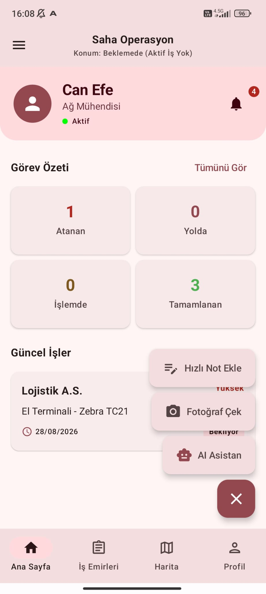
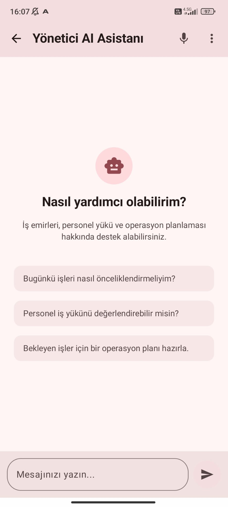
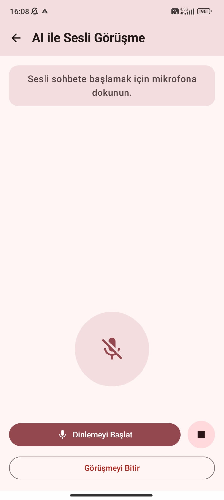

# Donanım Operasyon ve Servis Yönetim Sistemi

POS cihazı, tablet, yazıcı ve benzeri donanımların saha servis süreçlerini; iş emirlerini, personel operasyonlarını ve servis kayıtlarını mobil ortamdan yönetmek amacıyla geliştirilmiş Android uygulamasıdır.

Uygulama **Admin** ve **Personel** olmak üzere iki farklı kullanıcı rolüne sahiptir. İş emrinin oluşturulmasından saha operasyonunun tamamlanmasına kadar olan süreç; konum, bildirim, fotoğraf, servis kaydı ve yapay zekâ destekli operasyon özellikleriyle birlikte yönetilmektedir.

> Proje, 20 iş günlük zorunlu yazılım stajı kapsamında geliştirilmiş ve staj sonunda kurumda sunulmuştur.

---

## Temel Özellikler

### Admin

- Yönetici dashboard ve operasyon özeti
- İş emri oluşturma, görüntüleme ve yönetme
- Personele doğrudan iş atama ve iş havuzu
- Personel yönetimi ve iş yükü takibi
- İş emirlerinin durum ve işlem geçmişini görüntüleme
- Google Maps üzerinden saha/personel konumlarını görüntüleme
- Vardiya, izin ve fazla mesai yönetimi
- Bildirim merkezi ve FCM bildirimleri
- Servis sicili ve operasyonel istatistikler
- AI destekli operasyon ve karar desteği

### Personel

- Atanan ve havuzdaki iş emirlerini görüntüleme
- İş kabul/red ve red nedeni belirtme
- İş durumunu güncelleme
- Konum doğrulaması ve saha operasyonu
- Servis notu ve fotoğraf ekleme
- Dijital müşteri imzası
- Servis işlemini tamamlama ve raporlama
- Vardiya, izin ve fazla mesai işlemleri
- Bildirim merkezi
- AI destekli saha asistanı

### İş Emri Akışı

```text
Bekliyor
   ↓
Yolda
   ↓
İşleme Başlandı
   ↓
Parça Bekleniyor (gerektiğinde)
   ↓
Tamamlandı

Alternatif sonuç: İptal
```

---

## Teknoloji Stack'i

| Alan | Teknolojiler |
|---|---|
| Mobil | Kotlin, Android Studio |
| UI | Jetpack Compose, Material 3 |
| Mimari | MVVM, Repository Pattern, Use Case katmanı |
| Dependency Injection | Hilt |
| Asenkron Veri | Coroutines, Flow, StateFlow |
| Yerel Veri | Room |
| Backend | Firebase Authentication, Cloud Firestore, Cloud Functions |
| Bildirim | Firebase Cloud Messaging (FCM) |
| Konum | Google Maps SDK, Google Location Services |
| Saha İşlemleri | CameraX, dijital imza, PDF raporlama |
| AI | Gemini API, Groq fallback |

---

## Mimari

Proje, MVVM tabanlı katmanlı bir yapı ve Repository Pattern kullanılarak geliştirilmiştir.

```text
Jetpack Compose UI
        ↓
     ViewModel
        ↓
  Domain / Use Cases
        ↓
    Repository
     ↙      ↘
   Room    Firebase
              ↓
       Cloud Functions
```

Room yerel veri saklama için, Firebase servisleri ise uzaktaki operasyonel veriler ve backend işlemleri için kullanılmaktadır.

---

## AI Servis Asistanı

Uygulamada Admin ve Personel rollerine göre farklı amaçlarla çalışan bir AI Servis Asistanı bulunmaktadır.

```text
AiScreen
    ↓
AiViewModel
    ↓
AiRepository
    ↓
Firebase Callable Function
    ↓
Gemini
    ↓ başarısız olursa
Groq
```

**Admin tarafında** asistan; bekleyen işlerin değerlendirilmesi, personel iş yükünün yorumlanması, operasyonel önceliklendirme ve planlama gibi konularda karar desteği sağlar.

**Personel tarafında** ise saha ve servis operasyonlarıyla ilgili yardımcı asistan olarak kullanılmaktadır.

AI konuşma geçmişinden ve kendisine sağlanan operasyonel bağlamdan yararlanabilir. AI tarafından önerilen işlemler otomatik olarak veritabanına uygulanmaz; nihai operasyonel kontrol kullanıcıdadır.

Gemini ve Groq API anahtarları Android uygulamasında tutulmaz. AI istekleri Firebase Cloud Functions üzerinden gerçekleştirilir ve backend secret yönetimi kullanılır.

---

## Bildirim ve Saha Operasyonları

Firestore ve Firebase Cloud Messaging kullanılarak olay bazlı bir bildirim altyapısı oluşturulmuştur.

```text
Operasyonel Değişiklik
        ↓
    Firestore
        ↓
 Cloud Function
        ↓
Bildirim Kaydı + FCM
        ↓
  İlgili Kullanıcı
```

İş atama, kabul/red, yola çıkma, işleme başlama, parça bekleme, tamamlama ve personel yönetimiyle ilişkili çeşitli operasyonlarda bildirim üretilebilmektedir.

Konum servisleri ise saha operasyonlarıyla ilişkilendirilmiş; iş konumunun görüntülenmesi, personel konumu ve servis noktasına yakınlık kontrolü gibi işlemlerde kullanılmıştır.

---

## 📱 Ekran Görüntüleri

### Yönetici Paneli

<p align="center">
  
  
  
</p>

### İş Emri ve Servis Süreci

<p align="center">
  
  
  
</p>

### Personel ve AI

<p align="center">
  
  
  
</p>

## Kurulum ve Güvenlik

Projeyi çalıştırmak için Android Studio, bir Firebase projesi ve gerekli API yapılandırmaları gerekmektedir.

Firebase yapılandırma dosyası repository içerisinde tutulmamaktadır. Kendi Firebase projenize ait:

```text
google-services.json
```

dosyasını:

```text
app/google-services.json
```

konumuna eklemeniz gerekir.

Google Maps API key'i `local.properties` üzerinden sağlanır:

```properties
MAPS_API_KEY=YOUR_API_KEY
```

Gemini ve Groq API anahtarları istemci uygulamasına eklenmemelidir. AI entegrasyonu için gerekli secret'lar Firebase Cloud Functions tarafında güvenli şekilde yapılandırılmalıdır.

`local.properties`, `google-services.json`, `.env` ve benzeri yerel/gizli yapılandırmalar `.gitignore` ile repository dışında tutulmaktadır.

---

## Proje Hakkında

Bu proje, Samsun Üniversitesi Yazılım Mühendisliği bölümündeki **20 iş günlük zorunlu yazılım stajım** kapsamında geliştirilmiştir.

Proje sürecinde özellikle;

- Jetpack Compose ile kapsamlı Android arayüzleri geliştirme,
- MVVM ve Repository Pattern uygulama,
- Room ve Firebase'i aynı projede kullanma,
- rol bazlı kullanıcı akışları tasarlama,
- Cloud Functions ve FCM ile olay bazlı backend işlemleri geliştirme,
- Google Maps ve konum servislerini saha süreçlerine entegre etme,
- generative AI servislerini mobil uygulamaya güvenli bir backend üzerinden bağlama

konularında uygulamalı deneyim kazanılmıştır.

---

## Gelecekte Geliştirilebilecek Özellikler

- Daha gelişmiş offline senkronizasyon ve conflict resolution
- Mesafe ve iş yüküne göre otomatik personel önerisi
- Saha personeli için rota optimizasyonu
- Daha kapsamlı operasyonel analizler
- AI karar destek yeteneklerinin genişletilmesi
- Unit, integration ve UI test kapsamının artırılması
- Web tabanlı yönetici paneli

---

## Geliştirici

**Süeda Kanlı**  
Samsun Üniversitesi — Yazılım Mühendisliği

GitHub: `@suedaknl`
